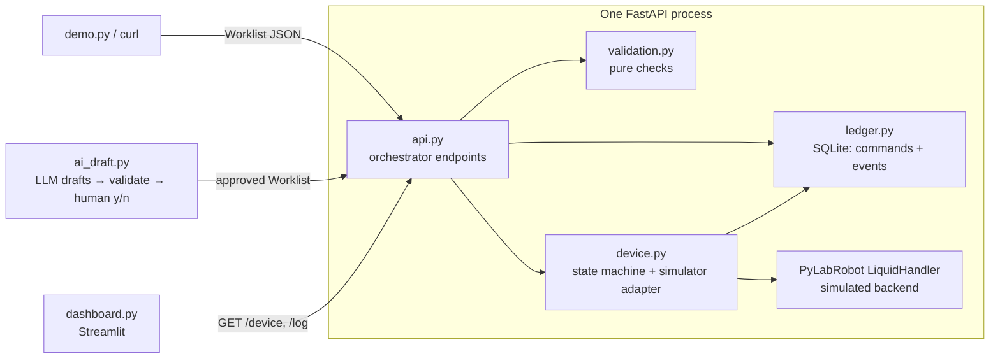
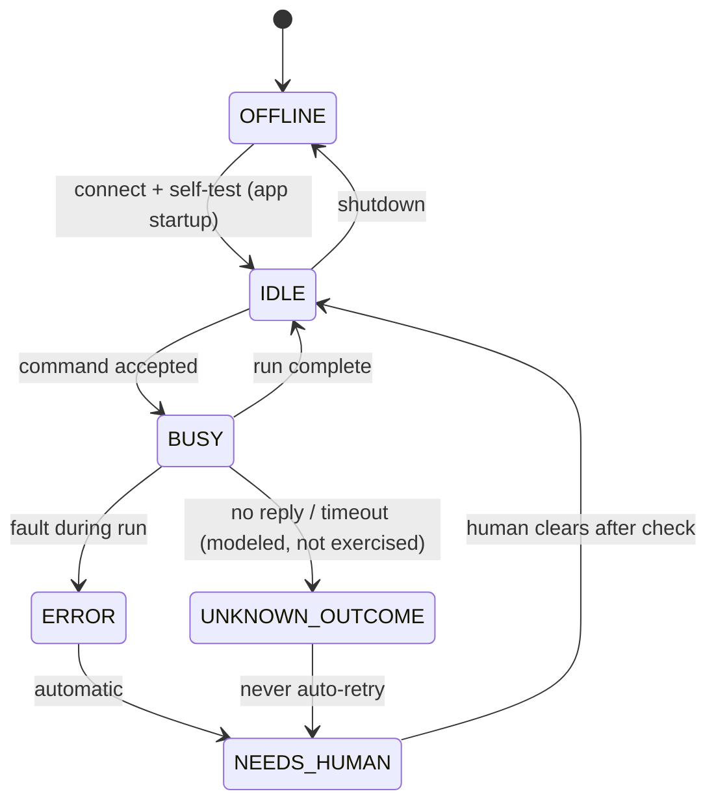

# Spec: Simulated Lab Integration

| | |
|---|---|
| **Status** | Implemented (amended while writing the plan, decision D8; AI call amended after the first live run, decision D9) |
| **Author** | Stevin Wilson |
| **Date** | 2026-09-30 |
| **Plan** | `docs/plans/2026-09-30-simulated-lab-integration-plan.md` (written after this spec is approved) |
| **Decisions** | [`docs/decisions.md`](../decisions.md) |

> This spec is the source of truth. Code, tests and the README follow it. If behavior changes, this file changes in the same pull request.

---

## 1. Purpose

A small, fully simulated integration between an orchestration API and a liquid handler. It is a learning project for the **control side** of lab automation:
- validating requests before a device is touched
- explicit device states
- idempotent commands
- safe failure handling
- a gated path for AI-proposed work

It is **not** a real instrument integration. The liquid handler is PyLabRobot's simulated backend, and every readout is synthetic.

## 2. Goals and non-goals

### Goals

1. One worklist's full path: **request → validation → idempotency check → simulated device execution → recorded result → status view**.
2. Production patterns, each provable by a test:
   - validation in code
   - an explicit state machine
   - idempotent commands
   - no automatic retry after a fault
   - human approval of AI-drafted work
3. Runs offline on a laptop. The README gets a new user from clone to running demo with copy-paste commands.
4. Small enough that every file can be explained in one sentence.

### Non-goals

- Real hardware, vendor SDKs, SiLA 2 servers or a scheduler.
- Auth, multiple users, high availability, containers or Kubernetes.
- Plate-reader readouts, file ingestion or measurement lineage (see §11).
- A general framework. Specific and small beats extensible.

## 3. Acceptance scenarios

Each scenario has a stable ID. The ID is the first column of this table and matches `^[A-Z]{1,2}[0-9]+$`. Every ID must have at least one test marked `@pytest.mark.spec("<ID>")`. `tests/test_traceability.py` enforces this in CI.

| ID | Given | When | Then |
|---|---|---|---|
| A1 | Device is `IDLE` | A valid worklist with a new `command_id` is submitted | Every transfer runs on the simulator (pick up tip → aspirate → dispense → drop tip). The response is `200` with `status: done`. The device returns to `IDLE`. The command and every state change appear in `GET /log`. |
| V1 | Any device state | A worklist with an invalid well (e.g. `I1`), a volume outside 1–200 µL, an unknown plate, or a destination that would exceed 300 µL is submitted | `422` with one specific message per problem. The device is never called. Nothing goes into the command ledger. A `rejected` event appears in `GET /log`. |
| F1 | Command `cmd-42` has completed | `cmd-42` is submitted again, simulating a lost reply | `200` with `duplicate: true` and the stored result. **The simulator is not called again.** A `duplicate` event appears in `GET /log`. |
| F3 | A fault is armed via `POST /device/fault` | The next worklist runs | The fault fires after the first transfer completes. The device moves `BUSY → ERROR → NEEDS_HUMAN`. The command is stored as `failed`, recording how many transfers completed. New commands get `409` until `POST /device/clear` returns the device to `IDLE`. Resending the failed `command_id` returns the stored failure and never retries. |
| AI1 | A recorded LLM response whose worklist contains a 250 µL transfer | `ai_draft` processes it in replay mode | The validation errors are shown and approval is **not offered**. Nothing is sent to the API, and the device is never called. |

## 4. Architecture

| Module | One-sentence responsibility | Real-lab counterpart |
|---|---|---|
| `src/labdemo/models.py` | Pydantic models (`Transfer`, `Worklist`) and 96-well plate constants. | Shared request schema |
| `src/labdemo/validation.py` | A pure function that returns a list of human-readable errors for a worklist. | Orchestrator input validation |
| `src/labdemo/device.py` | Owns the device state machine and calls a `Simulator` once per transfer. | Edge agent wrapping a vendor SDK |
| `src/labdemo/simulator.py` | The PyLabRobot-backed `Simulator`: pick up tip → aspirate → dispense → drop tip, on the chatterbox backend. | Vendor SDK or SiLA 2 client |
| `src/labdemo/ledger.py` | Persists command records (the idempotency key) and an event log in SQLite, and derives how much liquid each destination well already holds. | Command journal / audit trail |
| `src/labdemo/api.py` | HTTP endpoints that run validation, the idempotency check, the state check and execution, in that order. | Orchestration service |
| `src/labdemo/ai_draft.py` | Turns a plain-English request into a worklist with an LLM, validates it and asks a human to approve it. | AI-assisted protocol drafting |
| `dashboard.py` | A read-only status page showing device state and the event log. | Lab monitoring UI |
| `demo.py` | A scripted run through A1 → V1 → F1 → F3 against a running API. | Not applicable (demo harness) |

The **simulator boundary** is the `Simulator` protocol (`setup`, `stop`, `transfer`) that `Device.execute(worklist)` calls. A real vendor SDK or SiLA 2 client would replace only the class behind it.

## 5. Behavior

### 5.1 Plates and validation rules

- The plate registry is fixed in code:
  - `SRC1`: a 96-well source plate, assumed to have enough liquid.
  - `P1`: a 96-well destination plate, starting empty.
- Well IDs: rows `A`–`H`, columns `1`–`12`, e.g. `A1` or `H12`.
- Each transfer's volume must be at least 1 µL and at most 200 µL (the tip maximum).
- The final volume in each destination well, including earlier transfers in the same worklist, must be at most 300 µL.
- `source_plate` and `dest_plate` must be in the registry.
- Volume already in a destination well is derived from the ledger: every transfer of a `done` command, plus the completed transfers of a `failed` command. `in_progress` commands are ignored.
- A worklist has at least 1 and at most 96 transfers.
- Well IDs are matched exactly: `a1` and `A1 ` are invalid, not normalized.
- A volume that is not a finite number (NaN, infinity) is invalid.
- `validate()` returns *all* errors, not just the first. Each error names the transfer index, the field and the limit. For example: `transfers[2].volume_ul=250 exceeds max 200 µL`.

### 5.2 Device state machine

- The allowed transitions are a literal `dict[DeviceState, set[DeviceState]]`. Anything else raises `IllegalTransition`.
- Every transition writes an event with a timestamp, the from-state, the to-state and a reason.
- Commands are accepted only in `IDLE`.

### 5.3 Idempotency

Processing order inside `POST /commands`:
1. **Ledger lookup** by `command_id`, *before* validation. If found with the **same** worklist, in any status: `200` with `duplicate: true`, the stored status and result, and a `duplicate` event. Stop. If found with a **different** worklist: `409` ("command_id was already used with a different worklist") and a `rejected` event. Stop. Looking up first matters: validating first would reject the resend of a command that filled a well as an overfill, instead of reporting a duplicate.
2. **Validate.** On failure: `422` with the errors and a `rejected` event. Stop. The request body is also checked for shape (missing fields, wrong types); those failures return the same `422 {errors}` format.
3. **State check.** If the device is not `IDLE`: `409` with the current state. **The command is not recorded**, so the client may resend the same `command_id` later.
4. **Record as `in_progress`**, committed to SQLite *before* execution.
5. **Execute**, then update the record to `done` (`200`) or `failed` (`500` with error details and `transfers_completed`).

A resend of a `failed` or `in_progress` command never runs again. Recovery means a human clears the device and submits a **new** `command_id`.

`command_id` is always generated by client code, never by the LLM.

### 5.4 API contract

| Method & path | Success | Errors |
|---|---|---|
| `POST /commands` (body: `Worklist`) | `200 {command_id, status, duplicate, result}` | `422 {errors: [str]}`, `409 {detail, state}` (device not `IDLE`) or `409 {detail}` (command_id reused with a different worklist), `500 {command_id, status: "failed", error, transfers_completed}` |
| `GET /device` | `200 {state, since, armed_fault}` | — |
| `GET /log?limit=100` | `200 {events: [{at, kind, command_id, detail}]}`, newest first | — |
| `POST /device/fault` | `200 {armed_fault: true}`. A debug endpoint that arms a fault for the next run. | — |
| `POST /device/clear` (body: `{operator, note}`) | `200 {state: "IDLE"}` | `409` unless the state is `NEEDS_HUMAN` |

The event `kind` is one of: `submitted`, `rejected`, `duplicate`, `refused`, `done`, `failed`, `transition`, `fault_armed`, `cleared`.

### 5.5 AI gate (`ai_draft.py`)

1. The input is a plain-English request, e.g. "Transfer 50 µL from SRC1 A1–H1 into P1 column 1."
2. Call the Anthropic Messages API (`claude-sonnet-5-5`) with a single tool whose `input_schema` is the worklist-without-`command_id` JSON schema, `tool_choice: auto`, and a system-prompt instruction to call it. The prompt includes the plate registry and limits. The request does not force the tool because this model rejects forced tool use (HTTP 400), which the first live run found.
3. Save the raw response to `recordings/<name>.json` as `{request, model, origin, tool_input}`, where `origin` is `live` or `hand-written` (used for test fixtures). `--replay <name>` loads the file instead of calling the API, and the output is labeled **"recorded response"** plus the origin.
4. Code assigns the `command_id`, then runs `validate()`.
5. If there are errors, print them and exit non-zero. **Approval is not offered.**
6. If it is valid, print the worklist as a table and ask `Approve and submit? [y/N]`. Only `y` POSTs to `/commands`.

### 5.6 Dashboard

A single Streamlit page showing:
- a device state badge, with its color set by state
- the time since the last transition
- whether a fault is armed
- the event table (newest first), with `rejected`, `duplicate`, `refused` and `failed` rows highlighted
- a refresh button

The page reads `LABDEMO_API_URL`, defaulting to `http://127.0.0.1:8000`.

## 6. Error handling

| Situation | Behavior |
|---|---|
| Invalid worklist (schema or rules) | `422`, the device is never called |
| Device not `IDLE` | `409`, not recorded, safe to resend |
| Fault during run | Record `failed` with the number of transfers completed; `ERROR → NEEDS_HUMAN`; no retry |
| Illegal state transition in code | `IllegalTransition` is raised. This is a bug, and a test covers it. |
| LLM call fails or no API key | `ai_draft` exits with a clear message pointing to `--replay` |
| Dashboard can't reach the API | A banner shows the URL it tried |

## 7. Configuration

| Variable | Default | Used by |
|---|---|---|
| `LABDEMO_DB` | `./labdemo.db` | API |
| `LABDEMO_API_URL` | `http://127.0.0.1:8000` | dashboard, demo, ai_draft |
| `ANTHROPIC_API_KEY` | unset | `ai_draft` live mode only |

Variables are read from the environment or `.env` (loaded with python-dotenv). `.env.example` is committed and `.env` is gitignored. The API is started with `uvicorn labdemo.api:create_app --factory`, so importing the module has no side effects. To reset the demo, delete `labdemo.db`. `demo.py` prefixes its command IDs with a run timestamp, so repeated runs don't collide.

## 8. Testing and traceability

- pytest with FastAPI `TestClient`. Each test uses a temporary SQLite file.
- The simulator is the real PyLabRobot simulated backend, wrapped in a spy that counts calls. This proves "the device was never called" (V1, AI1) and "was not called again" (F1).
- No test touches the network. AI1 uses a committed recording.

| ID | Test | Module(s) under test |
|---|---|---|
| A1 | `tests/test_api.py::test_valid_worklist_executes` | `api`, `device`, `ledger` |
| V1 | `tests/test_validation.py::*`, `tests/test_api.py::test_invalid_worklist_never_reaches_device` | `validation`, `api` |
| F1 | `tests/test_api.py::test_duplicate_command_not_reexecuted` | `api`, `ledger` |
| F3 | `tests/test_api.py::test_fault_locks_device_until_cleared`, `tests/test_device.py::test_illegal_transitions_raise` | `device`, `api` |
| AI1 | `tests/test_ai_gate.py::test_invalid_llm_worklist_not_offered_for_approval` | `ai_draft`, `validation` |
| (meta) | `tests/test_traceability.py` | This spec ↔ test markers |

## 9. Tooling and quality gates

- **uv** handles the Python version (3.12, pinned in `.python-version`), dependencies and `uv.lock`, which is committed.
- **ruff** handles linting and formatting. **ty** handles type checking. Both are configured in `pyproject.toml`.
- **pre-commit** runs ruff, ruff-format, `ty check` and the hygiene hooks.
- **CI** (`.github/workflows/ci.yml`), on push and PR: `uv sync --locked`, then `uv run pre-commit run --all-files`, then `uv run pytest`.

## 10. Key decisions

Full records are in [`docs/decisions.md`](../decisions.md).

| Decision | Choice | Revisit when |
|---|---|---|
| Agent boundary | In-process module behind `Device` | More than one instrument, or the agent must run on the instrument PC |
| Execution model | Synchronous request | Runs take long enough that timeouts matter. Then switch to `202` + status polling or events. |
| Store | SQLite | More than one writer process. Then switch to PostgreSQL. |
| State machine | Hand-written transition table | The number of states grows large |
| LLM integration | Plain Anthropic SDK + a single tool call (`tool_choice: auto` plus an instruction) | Multi-step agent flows. Then use a LangGraph graph with an interrupt-based human node. |
| Simulator | PyLabRobot simulated backend | Swap for a real backend per instrument |

## 11. Out of scope, in production priority order

1. Exercise `UNKNOWN_OUTCOME` (reply timeout → `NEEDS_HUMAN`, no auto-retry).
2. Async execution (`202` + polling) and a separate edge-agent process per instrument.
3. Containerize with one Dockerfile, then Compose and Kubernetes.
4. A mock plate reader, file ingestion and per-well lineage (well → command → run).
5. Auth, operator identity on `clear`, and a scheduler (e.g. Cellario or Green Button Go) between the orchestrator and devices.

## 12. Honesty rules

- The simulator is never described as a real instrument. All data is labeled **synthetic**.
- Replayed LLM output is labeled **recorded response**.
- `BUILD_LOG.md` records what the AI generated, what was changed and what broke.
- No proprietary content from any employer, past or present.
